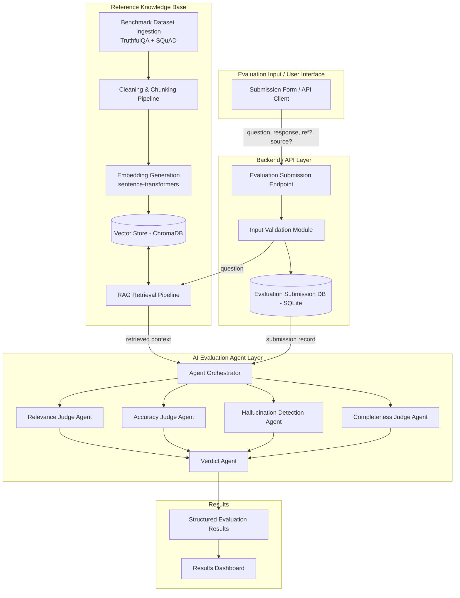

# LLM Response Evaluation Framework — Milestone 1

Multi-agent system to evaluate AI-generated responses for relevance, accuracy,
hallucination, and completeness, grounded against a RAG-based reference
knowledge base built from public QA benchmarks (TruthfulQA, SQuAD).

---

## 1. System Architecture



**Data flow (submission → result):**
1. User submits `question`, `ai_response`, optional `reference_answer` / `source_document` via API.
2. Backend validates input, persists it to the submission DB.
3. If no source document is provided, the RAG Retrieval Pipeline queries the
   Vector Store for the most relevant chunks from the benchmark-derived
   knowledge base, using the question as the query.
4. The Agent Orchestrator passes `{question, response, retrieved/provided context, reference_answer}`
   to all four judge agents in parallel.
5. Each judge agent returns a `{score, rationale}` pair.
6. The Verdict Agent aggregates the four scores into a final weighted score + pass/fail label.
7. Result is stored as structured JSON and made available to the dashboard (M2+).

---

## 2. Agent Responsibilities & Scoring

| Agent | Responsibility | Inputs | Output |
|---|---|---|---|
| **Evaluation Orchestrator** | Coordinates retrieval + fan-out/fan-in to judge agents | submission record | aggregated judge outputs |
| **Relevance Judge** | Does the response address what was actually asked? | question, response | score (0–1) + rationale |
| **Accuracy Judge** | Is the response factually correct against reference/retrieved context? | question, response, context | score (0–1) + rationale |
| **Hallucination Detector** | Which claims in the response are unsupported by context? | response, context | score (0–1, higher = less hallucination) + flagged claims |
| **Completeness Judge** | Does the response cover all aspects expected by the reference? | question, response, reference | score (0–1) + missing points |
| **Verdict Agent** | Weighted aggregation into final score + label | 4 judge scores | final score (0–1) + verdict (Pass/Review/Fail) |

**Scoring scale:** 0.0–1.0 continuous per dimension (stored as float), mapped to
Pass (≥0.75) / Review (0.5–0.74) / Fail (<0.5) at the Verdict stage. Chosen over
1–5 Likert for easier weighted averaging and threshold tuning later.

---

## 3. Tech Stack

| Layer | Choice | Why |
|---|---|---|
| API framework | FastAPI | async, auto-generates `/docs` (Swagger UI) — no separate frontend needed for M1 |
| Validation | Pydantic | built into FastAPI, strict schema enforcement |
| Submission storage | SQLite + SQLAlchemy | zero-infra, swappable for Postgres later |
| Benchmark datasets | HuggingFace `datasets` (TruthfulQA, SQuAD) | standard, versioned access |
| Chunking | LangChain `RecursiveCharacterTextSplitter` | battle-tested, avoids hand-rolled splitting |
| Embeddings | `sentence-transformers` (`all-MiniLM-L6-v2`) | free, local, fast, no API key |
| Vector store | ChromaDB (local/embedded) | zero infra, good enough for M1 scale |
| LLM (judge agents, M2+) | Claude API | reserved for M2 — not wired up yet |

---

## 4. Repo Structure

```
eval-project/
├── app/                # M1.3 - Evaluation Input Module
│   ├── main.py          # FastAPI app + /evaluate/submit endpoint
│   ├── schemas.py        # Pydantic request/response models
│   └── db.py             # SQLAlchemy engine + models
├── kb/                  # M1.4 - Reference Knowledge Base
│   ├── ingest.py          # download + clean + chunk + embed + index
│   └── retrieve_test.py   # sample retrieval quality check
├── requirements.txt
└── README.md
```

## 5. Setup

```bash
python -m venv venv && source venv/bin/activate
pip install -r requirements.txt

# Run the input API
uvicorn app.main:app --reload
# Swagger UI: http://localhost:8000/docs

# Build the knowledge base (downloads dataset subsets + builds Chroma index)
python kb/ingest.py

# Sanity-check retrieval quality
python kb/retrieve_test.py
```

## 6. Status vs Milestone 1 checklist

- [x] M1.1 Research summary (this README, Architecture + Tech Stack sections)
- [x] M1.2 Architecture diagram, agent responsibilities, scoring scale, data flow
- [x] M1.3 Evaluation input endpoint with validation + persistence
- [x] M1.4 Dataset ingestion, chunking, embedding, vector indexing, retrieval test
- [ ] Judge agent logic (LLM-backed) — planned for Milestone 2
