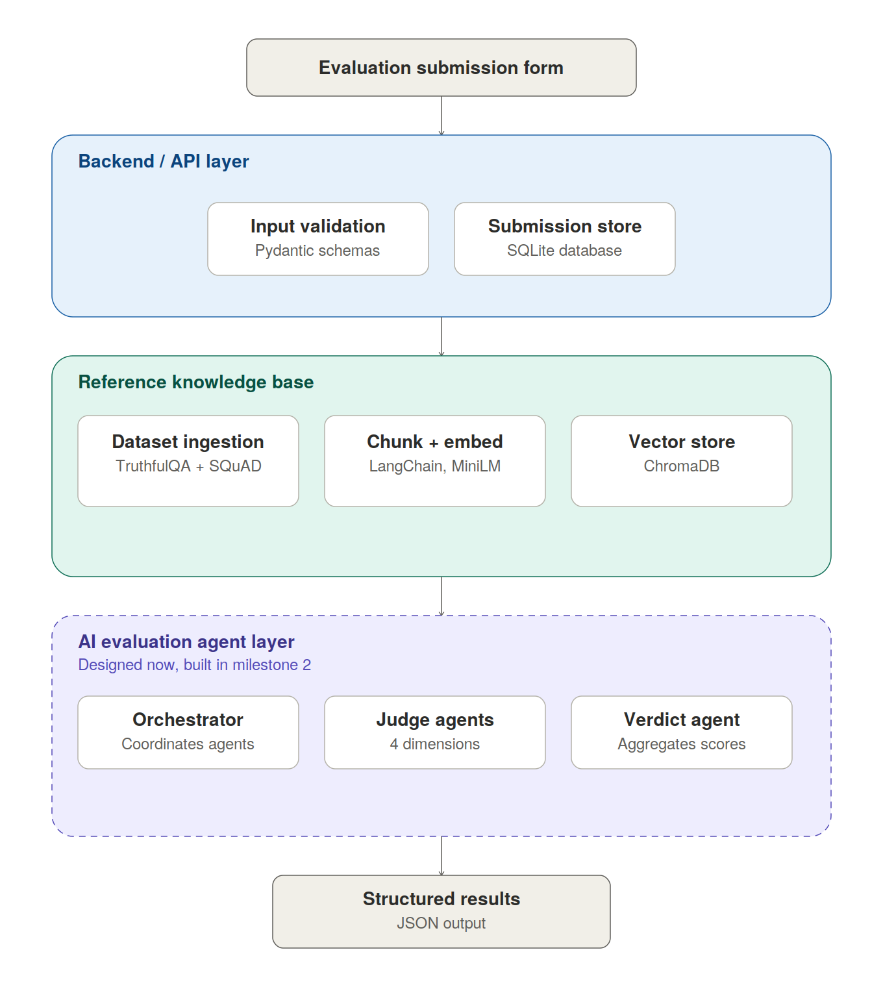

# LLM response evaluation framework

A small system for automatically evaluating an LLM's response to a question along four dimensions - relevance, accuracy, hallucination, and completeness - using an LLM-as-a-judge approach grounded in a retrieval-augmented reference knowledge base.

This repo currently covers **Milestone 1**: research, system design, the evaluation input module, and the reference knowledge base. The judge/verdict agents (Milestone 2) are designed in the architecture doc but not yet implemented - they depend on the Claude API, which M1 deliberately avoids so this part could be built and tested for free.

## Milestone 1 scope

| Task | Status | Where |
|---|---|---|
| M1.1 Research | done | [`docs/research-notes.md`](docs/research-notes.md) |
| M1.2 System architecture | done | [`docs/architecture.svg`](docs/architecture.svg), [`docs/tech-stack.md`](docs/tech-stack.md) |
| M1.3 Evaluation input module | done | [`src/input_module/`](src/input_module) |
| M1.4 Reference knowledge base | done | [`src/knowledge_base/`](src/knowledge_base) |

## Architecture



Full write-up of the reasoning behind this in [`docs/research-notes.md`](docs/research-notes.md) and the tech choices in [`docs/tech-stack.md`](docs/tech-stack.md).

## Project layout

```
src/
  input_module/       # M1.3 - FastAPI submission endpoint
    main.py
    schemas.py
    storage.py
  knowledge_base/      # M1.4 - dataset ingestion -> chunking -> embedding -> vector store
    ingest.py
    chunking.py
    embeddings.py
    vector_store.py
    build_index.py
tests/
  test_retrieval.py    # sanity check on retrieval quality
docs/
  architecture.svg / .png
  tech-stack.md
  research-notes.md
data/                  # sqlite db + chroma index get created here at runtime
```

## Running it

```bash
pip install -r requirements.txt

# 1. Build the reference knowledge base (ingest + chunk + embed + index)
python -m src.knowledge_base.build_index

# 2. Sanity-check retrieval quality
python -m tests.test_retrieval

# 3. Configure Gemini API key
cp .env.example .env
# Edit .env and set your GEMINI_API_KEY

# 4. Run Milestone 2 validation suite (Relevance, Accuracy, Hallucination)
python -m tests.test_milestone2

# 5. Run the API with evaluation endpoints
uvicorn src.input_module.main:app --reload
```

Submit and evaluate directly via API:

```bash
curl -X POST http://localhost:8000/api/v1/evaluate \
  -H "Content-Type: application/json" \
  -d '{"question": "What is the capital of France?", "ai_response": "Paris is the capital of France."}'
```
