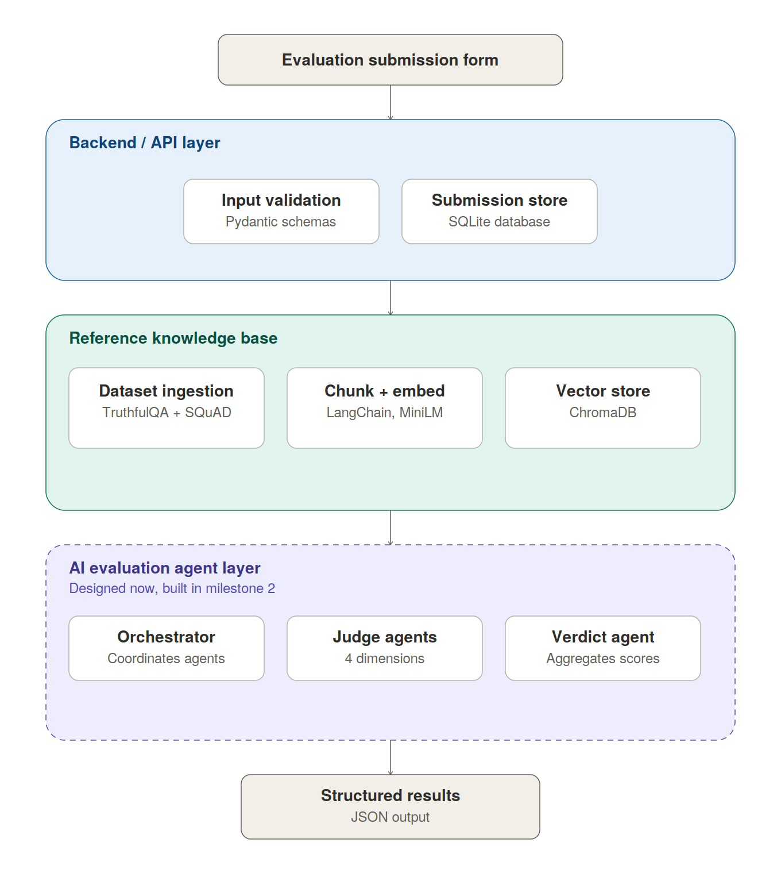

# LLM response evaluation framework

A small system for automatically evaluating an LLM's response to a question along four dimensions - relevance, accuracy, hallucination, and completeness - using an LLM-as-a-judge approach grounded in a retrieval-augmented reference knowledge base.

This repo covers **Milestone 1**, **Milestone 2**, and **Milestone 3**: research, system design, RAG knowledge base, multi-agent judge evaluation (Relevance, Accuracy, Hallucination, Completeness), weighted quality verdict synthesis, and high-volume batch evaluation (100+ records via CSV).

## Project Milestones

| Milestone | Scope | Status | Where |
|---|---|---|---|
| **Milestone 1** | Input module & ChromaDB RAG Knowledge Base | done | [`src/input_module/`](src/input_module), [`src/knowledge_base/`](src/knowledge_base) |
| **Milestone 2** | Relevance, Accuracy, Hallucination Detection Agents | done | [`src/agents/`](src/agents), [`tests/test_milestone2.py`](tests/test_milestone2.py) |
| **Milestone 3** | Completeness Agent, Verdict Agent, Results Display & Batch CSV Module | done | [`src/agents/completeness_agent.py`](src/agents/completeness_agent.py), [`src/agents/verdict_agent.py`](src/agents/verdict_agent.py), [`src/agents/batch_evaluator.py`](src/agents/batch_evaluator.py) |

## Architecture



Full write-up of the reasoning behind this in [`docs/research-notes.md`](docs/research-notes.md) and the tech choices in [`docs/tech-stack.md`](docs/tech-stack.md).

## Project layout

```
src/
  input_module/       # M1.3 / M3.3 / M3.4 - FastAPI endpoints + modern dashboard UI
    main.py           # Single & batch evaluation endpoints
    schemas.py        # Submission models
    storage.py        # SQLite history persistence
    static/index.html # Interactive UI (Single eval + 100+ CSV batch evaluation)
  agents/             # M2 & M3 multi-agent evaluation system
    relevance_agent.py      # M2.1 Relevance Judge
    accuracy_agent.py       # M2.2 Accuracy Judge
    hallucination_agent.py  # M2.3 Hallucination Detection Agent
    completeness_agent.py   # M3.1 Completeness Judge Agent
    verdict_agent.py        # M3.2 Verdict Agent (weighted scoring + safety overrides)
    batch_evaluator.py      # M3.4 Batch Evaluation Module (CSV upload, stats, export)
    orchestrator.py         # Multi-agent coordinator & RAG resolver
    schemas.py              # Pydantic structured output models
    base.py                 # Gemini structured output wrapper & offline simulation
  knowledge_base/     # M1.4 - dataset ingestion -> chunking -> embedding -> vector store
    ingest.py
    chunking.py
    embeddings.py
    vector_store.py
    build_index.py
tests/
  test_retrieval.py    # M1 sanity check on retrieval quality
  test_milestone2.py   # M2 validation suite (Relevance, Accuracy, Hallucination)
  test_milestone3.py   # M3 validation suite (Completeness, Verdict, 100+ Batch CSV)
docs/
  architecture.svg / .png
  tech-stack.md
  research-notes.md
data/                  # sqlite db + chroma index get created here at runtime
```

## Running it

```bash
pip install -r requirements.txt

# 1. Build the reference knowledge base (ingest + chunk + embed + index)
python -m src.knowledge_base.build_index

# 2. Sanity-check retrieval quality
python -m tests.test_retrieval

# 3. Configure Gemini API key (optional for offline testing; required for live Gemini calls)
cp .env.example .env
# Edit .env and set your GEMINI_API_KEY

# 4. Run Milestone 2 validation suite
python -m tests.test_milestone2

# 5. Run Milestone 3 validation suite (Completeness, Verdict, 100+ Batch CSV)
python -m tests.test_milestone3

# 6. Run the API with evaluation dashboard
uvicorn src.input_module.main:app --reload
```

Open your browser at `http://localhost:8000` to interact with the evaluation platform:
- **Single Response Evaluation**: Inspect per-dimension scores, supporting evidence, hallucinated claims, missing aspects, and executive verdict.
- **Batch Evaluation**: Upload CSVs with 100+ question-answer pairs, monitor progress, analyze aggregated batch statistics, inspect individual items in a modal, and export full reports to CSV.

