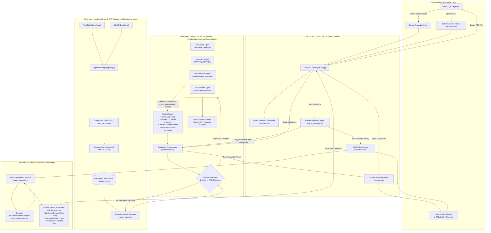

# System Architecture & Topology

## Overview

The **LLM Response Evaluation Framework** is an enterprise-grade multi-agent system designed to evaluate, benchmark, and audit AI-generated textual responses. The architecture cleanly decouples ingestion, ground-truth context retrieval, specialized dimensional evaluation, verdict synthesis, persistent storage, interactive dashboard analytics, and publication-ready PDF reporting.

---

## Architectural Diagram

The diagram below illustrates the end-to-end component topology, data flows, and communication contracts across all framework subsystems:

---

## Subsystem Breakdown

### 1. Presentation & Input Module ([`src/input_module/`](file:///C:/Sejal/Infosys%20Springboard/llm-response-eval-framework/src/input_module))
- **FastAPI Gateway (`main.py`)**: Exposes RESTful endpoints for single submissions, batch CSV uploads, real-time KPI queries, historical batch retrieval, and report streaming.
- **Input Validation & Schemas (`schemas.py`)**: Enforces strict payload contracts on incoming evaluation requests using Pydantic v2.
- **Interactive Dashboard (`static/index.html`)**: A responsive browser interface featuring real-time evaluation testing, batch CSV drag-and-drop, interactive KPI summary tiles, verdict distribution charts, radar charts, recommendation cards, and one-click PDF/CSV export buttons.

### 2. Reference Knowledge Base & RAG Pipeline ([`src/knowledge_base/`](file:///C:/Sejal/Infosys%20Springboard/llm-response-eval-framework/src/knowledge_base))
- **Ingestion (`ingest.py`)**: Downloads and standardizes benchmark data from HuggingFace Datasets (TruthfulQA for concise factual QA, SQuAD for long-form contextual passages).
- **Chunking (`chunking.py`)**: Splits passage context into overlapping text segments using LangChain's `RecursiveCharacterTextSplitter` ($chunk\_size=500$, $overlap=80$).
- **Dense Embeddings (`embeddings.py`)**: Generates 384-dimensional dense semantic vectors using `sentence-transformers/all-MiniLM-L6-v2` locally with zero external API dependencies.
- **Vector Store & Retrieval (`vector_store.py`)**: Stores chunk vectors and document metadata inside an embedded ChromaDB collection (`reference_kb`), executing cosine similarity searches to retrieve the top-$k$ nearest context passages.

### 3. Orchestration & Multi-Agent Core ([`src/agents/`](file:///C:/Sejal/Infosys%20Springboard/llm-response-eval-framework/src/agents))
- **Evaluation Orchestrator (`orchestrator.py`)**: Central coordinator that resolves ground-truth context (using provided references or falling back to ChromaDB RAG retrieval), launches the 4 dimensional judge agents concurrently via `asyncio.gather`, and passes results to the Verdict Agent.
- **Relevance Agent (`relevance_agent.py`)**: Evaluates whether the generated response directly answers the user's question.
- **Accuracy Agent (`accuracy_agent.py`)**: Evaluates factual correctness against reference answers and retrieved passages.
- **Hallucination Agent (`hallucination_agent.py`)**: Decomposes responses into atomic claims and validates each claim against ground truth to identify fabrications and ungrounded statements.
- **Completeness Agent (`completeness_agent.py`)**: Assesses coverage of key aspects and sub-questions, tagging missing elements.
- **Verdict Agent (`verdict_agent.py`)**: Synthesizes the 4 dimensional scores into an overall weighted score, enforces critical failure overrides, and issues a final `Pass`, `Needs Improvement`, or `Fail` verdict.
- **Batch Evaluator (`batch_evaluator.py`)**: Ingests multi-row CSV files, normalizes flexible headers, enforces bounded concurrent evaluation (`asyncio.Semaphore`), calculates statistical KPIs, and persists batch results.

### 4. Storage Subsystem
- **SQLite Database (`submissions.db` via `storage.py`)**: Stores interactive single evaluations, input prompts, model responses, reference answers, dimensional scores, and verdict metadata.
- **File-Based JSON Batch Store (`data/batches/`)**: Persists complete batch evaluation summaries (metadata, items, statistics, error logs) as self-contained JSON records for zero-dependency archival and fast aggregation.

### 5. Reporting Subsystem ([`src/reporting/`](file:///C:/Sejal/Infosys%20Springboard/llm-response-eval-framework/src/reporting))
- **Report Aggregation Service (`report_service.py`)**: A pure data aggregation layer that pulls from stored evaluation records and transforms them into an aggregated `BatchReportData` object.
- **Dynamic Recommendations Engine (`recommendations.py`)**: Analyzes aggregated batch weaknesses and generates 2 to 5 prioritized, plain-English improvement recommendations citing empirical metric triggers.
- **PDF Report Generator (`pdf_generator.py`)**: ReportLab Platypus engine generating publication-grade evaluation documents featuring custom running headers, two-pass `NumberedCanvas` ("Page X of Y"), executive KPI summary grids, verdict charts, and per-response detail cards with color-coded verdict badges.

---

## Data Flow Lifecycle

### Workflow A: Single Evaluation
1. **Submission**: User enters Question, AI Response, and optional Reference Answer / Source Document in the UI or via `POST /evaluate`.
2. **Context Resolution**: The Orchestrator checks for explicit context. If absent, it queries ChromaDB with the question and retrieves top-$k$ reference chunks.
3. **Concurrent Judging**: `asyncio.gather` executes `RelevanceAgent`, `AccuracyAgent`, `HallucinationAgent`, and `CompletenessAgent` in parallel.
4. **Synthesis**: The `VerdictAgent` calculates the weighted composite score, checks critical-failure override rules, and assigns the final verdict.
5. **Storage & Display**: The evaluation record is persisted to SQLite and returned as JSON to the UI for live display.

### Workflow B: Batch CSV Evaluation & PDF Export
1. **Upload**: User uploads a CSV file containing multiple question-response pairs via `POST /evaluate/batch`.
2. **Ingestion & Validation**: `BatchEvaluator` normalizes headers, sniffs delimiters, skips empty rows, and isolates malformed records.
3. **Bounded Execution**: Records are evaluated concurrently up to the configured limit (`concurrency_limit=5`).
4. **Batch Persistence**: The complete evaluation summary with per-record scores and aggregated statistics is written to `data/batches/{batch_id}.json`.
5. **Report Aggregation**: When the user requests a PDF, `ReportService` loads the stored JSON and constructs `BatchReportData`.
6. **Recommendation Scan**: `RecommendationEngine` scans failure rates and generates 2–5 prioritized remediations.
7. **PDF Generation**: `PDFReportGenerator` compiles the multi-page ReportLab document and streams it to the user.
