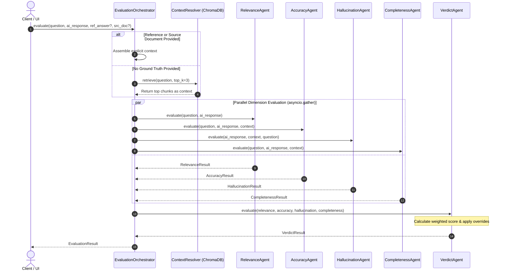

# Multi-Agent Evaluation System: Responsibilities & Workflows

## Overview

The evaluation engine employs a decoupled, multi-agent architecture where distinct, specialized agents evaluate orthogonal dimensions of LLM response quality. The system executes dimensional agents concurrently, followed by a deterministic synthesis pass in the Verdict Agent.



---

## 1. Relevance Agent ([`src/agents/relevance_agent.py`](file:///C:/Sejal/Infosys%20Springboard/llm-response-eval-framework/src/agents/relevance_agent.py))

### Primary Responsibility
Determines whether the AI-generated response directly, appropriately, and meaningfully addresses the question asked by the user, independent of factual correctness.

### Inputs & Outputs
- **Inputs**: `question: str`, `ai_response: str`
- **Output Schema**: [`RelevanceResult`](file:///C:/Sejal/Infosys%20Springboard/llm-response-eval-framework/src/agents/schemas.py#L30-L34)
  - `score: float` (0.0 to 1.0)
  - `classification: Literal["fully_relevant", "partially_relevant", "unrelated", "off_topic"]`
  - `reasoning: str`

### Evaluation Rubric & Workflow
1. **Semantic Alignment**: Analyzes the core intent and constraints of the user's prompt.
2. **Deflection / Evasion Detection**: Checks if the response changes the subject, provides unsolicited disclaimers, or generates generic filler.
3. **Scoring Calibration**:
   - `fully_relevant` ($0.85 - 1.00$): Directly addresses the question with targeted information.
   - `partially_relevant` ($0.50 - 0.84$): Addresses part of the question but digresses into adjacent topics or includes excessive unprompted content.
   - `unrelated` / `off_topic` ($0.00 - 0.49$): Fails to address the question asked or answers a completely different prompt.

---

## 2. Accuracy Agent ([`src/agents/accuracy_agent.py`](file:///C:/Sejal/Infosys%20Springboard/llm-response-eval-framework/src/agents/accuracy_agent.py))

### Primary Responsibility
Verifies the factual correctness of assertions in the AI response against the ground-truth reference answer and/or retrieved knowledge base context.

### Inputs & Outputs
- **Inputs**: `question: str`, `ai_response: str`, `context: str`
- **Output Schema**: [`AccuracyResult`](file:///C:/Sejal/Infosys%20Springboard/llm-response-eval-framework/src/agents/schemas.py#L36-L43)
  - `score: float` (0.0 to 1.0)
  - `classification: Literal["correct", "partially_correct", "incorrect", "contradictory"]`
  - `supporting_evidence: List[str]` (exact quotes or citations from reference context)
  - `reasoning: str`

### Evaluation Rubric & Workflow
1. **Fact Checking**: Compares each statement against known facts in the reference context.
2. **Contradiction Flagging**: Specifically checks for direct contradictions (e.g., claiming sound travels faster in air than water when the context states the opposite).
3. **Scoring Calibration**:
   - `correct` ($0.85 - 1.00$): All facts match ground-truth assertions.
   - `partially_correct` ($0.50 - 0.84$): Core premise is accurate, but minor details, numbers, or dates contain minor errors.
   - `incorrect` ($0.20 - 0.49$): Substantial factual inaccuracies across major assertions.
   - `contradictory` ($0.00 - 0.19$): Expressly contradicts verified facts in the context.

---

## 3. Hallucination Agent ([`src/agents/hallucination_agent.py`](file:///C:/Sejal/Infosys%20Springboard/llm-response-eval-framework/src/agents/hallucination_agent.py))

### Primary Responsibility
Detects ungrounded, fabricated, or unsupported statements using **claim decomposition**, ensuring responses are strictly grounded in verifiable source documents.

### Inputs & Outputs
- **Inputs**: `ai_response: str`, `context: str`, `question: Optional[str]`
- **Output Schema**: [`HallucinationResult`](file:///C:/Sejal/Infosys%20Springboard/llm-response-eval-framework/src/agents/schemas.py#L55-L70)
  - `is_hallucinated: bool` (`True` if any claim is unsupported or contradicted)
  - `hallucination_score: float` (fraction of claims unsupported: $0.0 = \text{grounded}, 1.0 = \text{hallucinated}$)
  - `total_claims: int`
  - `unsupported_claims_count: int`
  - `flagged_claims: List[ClaimEvaluation]`
  - `all_claims: List[ClaimEvaluation]`
  - `reasoning: str`

### Claim Decomposition Workflow
```
[AI Response]
     │
     ▼
Deconstruct into discrete atomic factual claims
     │
     ├─ Claim 1: "The Apollo 11 mission landed in July 1969." ──► Verify against context ──► Supported
     ├─ Claim 2: "It carried a crew of 5 astronauts."        ──► Verify against context ──► Contradicted (3 crew members)
     └─ Claim 3: "It cost $420 billion in 1969 dollars."     ──► Verify against context ──► Unsupported (no citation)
     │
     ▼
Calculate Hallucination Score: 2 unsupported / 3 total = 0.67 (Flag is_hallucinated = True)
```

Each atomic claim is classified into one of three statuses:
- `supported`: Verified directly by quoted passage in context.
- `unsupported`: Plausible assertion but completely absent from context.
- `contradicted`: Directly refuted by contextual evidence.

---

## 4. Completeness Agent ([`src/agents/completeness_agent.py`](file:///C:/Sejal/Infosys%20Springboard/llm-response-eval-framework/src/agents/completeness_agent.py))

### Primary Responsibility
Assesses whether the response thoroughly covers all required aspects, sub-questions, and constraints specified in the prompt or expected from the reference answer.

### Inputs & Outputs
- **Inputs**: `question: str`, `ai_response: str`, `context: str`
- **Output Schema**: [`CompletenessResult`](file:///C:/Sejal/Infosys%20Springboard/llm-response-eval-framework/src/agents/schemas.py#L93-L113)
  - `score: float` (0.0 to 1.0)
  - `classification: Literal["fully_complete", "mostly_complete", "partially_complete", "incomplete"]`
  - `identified_requirements: List[str]`
  - `addressed_aspects: List[str]`
  - `partially_addressed_aspects: List[str]`
  - `missing_aspects: List[str]`
  - `reasoning: str`

### Evaluation Rubric & Workflow
1. **Aspect Extraction**: Dissects the question and reference into required elements (e.g., if asked "What is photosynthesis and why is it important?", requirements are (1) mechanism/definition and (2) ecological importance).
2. **Coverage Mapping**: Tags each requirement as addressed, partially addressed, or missing.
3. **Scoring Calibration**:
   - `fully_complete` ($0.85 - 1.00$): All identified requirements covered in depth.
   - `mostly_complete` ($0.70 - 0.84$): Covers main requirements; minor nuance omitted.
   - `partially_complete` ($0.40 - 0.69$): Omits one or more substantial sub-questions.
   - `incomplete` ($0.00 - 0.39$): Fails to answer the majority of the requirements.

---

## 5. Verdict Agent ([`src/agents/verdict_agent.py`](file:///C:/Sejal/Infosys%20Springboard/llm-response-eval-framework/src/agents/verdict_agent.py))

### Primary Responsibility
Synthesizes the outputs of the four judge agents into a single weighted score, enforces critical failure overrides, and determines the final quality verdict (`Pass`, `Needs Improvement`, or `Fail`).

> [!IMPORTANT]
> **Zero LLM Re-evaluation Constraint**: The Verdict Agent operates purely as a deterministic synthesis layer. It does not invoke LLM prompts or re-score dimensions, guaranteeing rapid, reproducible verdicts without redundant API consumption.

### Inputs & Outputs
- **Inputs**: `relevance: RelevanceResult`, `accuracy: AccuracyResult`, `hallucination: HallucinationResult`, `completeness: CompletenessResult`
- **Output Schema**: [`VerdictResult`](file:///C:/Sejal/Infosys%20Springboard/llm-response-eval-framework/src/agents/schemas.py#L122-L141)
  - `weighted_score: float` (0.0 to 1.0)
  - `verdict: Literal["Pass", "Needs Improvement", "Fail"]`
  - `dimension_scores: Dict[str, float]`
  - `major_issues: List[str]`
  - `strengths: List[str]`
  - `consolidated_reasoning: str`

---

## 6. Evaluation Orchestrator ([`src/agents/orchestrator.py`](file:///C:/Sejal/Infosys%20Springboard/llm-response-eval-framework/src/agents/orchestrator.py))

### Primary Responsibility
Coordinates the complete lifecycle of a single evaluation:
1. **Context Resolution**: Checks if explicit `reference_answer` or `source_document` were provided. If not, queries the ChromaDB vector store (`top_k=3`) using the question as the semantic query.
2. **Concurrent Dispatch**: Uses `asyncio.gather` to execute all four dimensional agents concurrently.
3. **Synthesis**: Passes agent outputs to the `VerdictAgent` and builds the final `EvaluationResult`.
4. **Resilience**: Implements defensive exception handling so an unhandled error in one agent does not crash the entire evaluation pipeline.

---

## 7. Batch Evaluator ([`src/agents/batch_evaluator.py`](file:///C:/Sejal/Infosys%20Springboard/llm-response-eval-framework/src/agents/batch_evaluator.py))

### Primary Responsibility
Manages multi-record evaluation workloads (up to 500+ records) loaded from CSV files.
- **Header Normalization**: Tolerates diverse naming conventions across columns.
- **Concurrency Throttling**: Utilizes `asyncio.Semaphore(concurrency_limit=5)` to prevent event loop saturation and external rate limit exhaustion (`429 Too Many Requests`).
- **Partial Failure Isolation**: Catches errors on individual malformed rows, marking them as `failed` or `skipped` while allowing all valid records to complete.
- **Statistical Aggregation**: Computes overall batch KPIs (Pass Rate, Hallucination Rate, Average Dimensional Scores) and serializes results to `data/batches/{batch_id}.json`.
