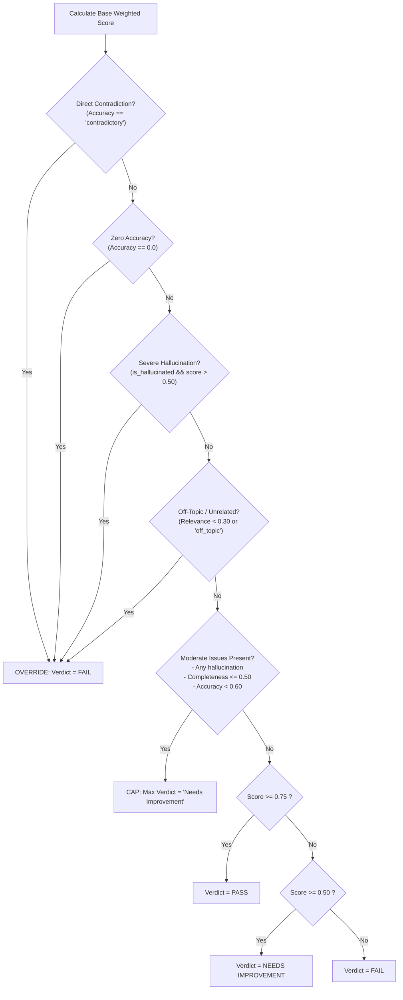

# Scoring Dimensions, Scales, Weighted Model & Verdict Thresholds

## Overview

The evaluation framework scores every AI response across four standardized dimensions using a continuous **0.0 to 1.0 scale**. Rather than computing a naive arithmetic average, the system employs a **weighted multi-criteria decision model** with **safety override guardrails** to generate reliable, enterprise-ready verdicts.

---

## 1. Evaluation Dimensions & Standardized Scales

All agents evaluate their respective quality axes on a normalized interval:

$$S \in [0.0, 1.0]$$

| Dimension | Evaluation Focus | Primary Agent | Base Weight ($w_i$) | Derived From |
| :--- | :--- | :--- | :---: | :--- |
| **Accuracy** | Factual correctness against ground truth | `AccuracyAgent` | **0.35** (35%) | Direct factual verification |
| **Completeness** | Depth of coverage across required sub-questions | `CompletenessAgent` | **0.25** (25%) | Aspect coverage fraction |
| **Relevance** | Directness in answering the user prompt | `RelevanceAgent` | **0.20** (20%) | Semantic prompt alignment |
| **Groundedness** | Absence of fabricated or unsupported claims | `HallucinationAgent` | **0.20** (20%) | `1.0 - hallucination_score` |

### Groundedness Derivation
The `HallucinationAgent` outputs `hallucination_score` representing the fraction of factual assertions that are ungrounded or contradicted ($0.0 = \text{clean}, 1.0 = \text{entirely hallucinated}$). To align with other dimensions where higher is better, **Groundedness** is calculated as:

$$\text{Groundedness} = \max\left(0.0, \min\left(1.0, 1.0 - S_{\text{hallucination}}\right)\right)$$

---

## 2. Weighted Composite Scoring Model

The base weighted composite score $S_{\text{weighted}}$ is calculated as:

$$S_{\text{weighted}} = w_{\text{acc}} \cdot S_{\text{acc}} + w_{\text{comp}} \cdot S_{\text{comp}} + w_{\text{rel}} \cdot S_{\text{rel}} + w_{\text{grd}} \cdot S_{\text{grd}}$$

Substituting default weights:

$$S_{\text{weighted}} = 0.35 \cdot S_{\text{acc}} + 0.25 \cdot S_{\text{comp}} + 0.20 \cdot S_{\text{rel}} + 0.20 \cdot S_{\text{grd}}$$

### Weight Normalization Guarantee
The `VerdictAgent` enforces that the sum of weights strictly equals 1.0:

$$\sum_{i} w_i = 1.0$$

If customized weights deviate ($|\sum w_i - 1.0| > 10^{-4}$), each weight is automatically normalized by dividing by the sum:

$$w_i^{\text{normalized}} = \frac{w_i}{\sum_{j} w_j}$$

---

## 3. Verdict Thresholds

Under baseline conditions without safety overrides, verdicts are assigned using two calibrated thresholds:
- **Pass Threshold**: $T_{\text{pass}} = 0.75$
- **Needs Improvement Threshold**: $T_{\text{needs}} = 0.50$

| Verdict Category | Score Condition | Practical Meaning |
| :--- | :---: | :--- |
| **Pass** | $S_{\text{weighted}} \ge 0.75$ | The response meets enterprise quality standards across all dimensions without major omissions or hallucinations. |
| **Needs Improvement** | $0.50 \le S_{\text{weighted}} < 0.75$ | The response contains useful information but exhibits minor factual errors, omitted aspects, or partial ungroundedness. |
| **Fail** | $S_{\text{weighted}} < 0.50$ | The response is severely deficient, incorrect, off-topic, or heavily fabricated. |

---

## 4. Safety Guardrails: Critical Failure Overrides

A purely weighted score can mask catastrophic localized failures (e.g., a response that is 100% relevant and 100% complete, but asserts a dangerous medical contradiction, could still score $0.65$ and avoid a `Fail`). 

To eliminate this vulnerability, the `VerdictAgent` enforces four **deterministic Critical Failure Overrides** that immediately force the verdict to **`Fail`**, regardless of the composite weighted score:



### Critical Override Rules

1. **Direct Contradiction**:
   ```
   accuracy.classification == "contradictory"  ==>  Verdict = FAIL
   ```
   *Rationale*: Asserting facts that directly refute the verified reference source poses significant compliance and trust risks.
2. **Zero Accuracy**:
   ```
   accuracy.score == 0.0  ==>  Verdict = FAIL
   ```
   *Rationale*: Responses with no factual merit cannot pass.
3. **Severe Hallucination**:
   ```
   is_hallucinated == True AND hallucination_score > 0.50  ==>  Verdict = FAIL
   ```
   *Rationale*: When over 50% of the factual claims are ungrounded or fabricated, the generation is unreliable.
4. **Critical Off-Topic / Unrelated**:
   ```
   relevance.score < 0.30 OR relevance.classification IN {"unrelated", "off_topic"}  ==>  Verdict = FAIL
   ```
   *Rationale*: A response that fails to address the user's inquiry provides zero utility.

---

## 5. Moderate Issue Caps (Quality Ceiling)

If a response avoids a critical failure override but contains notable defects, the `VerdictAgent` imposes a **Quality Ceiling** preventing a `Pass` verdict:

$$\text{Maximum Allowed Verdict} = \mathbf{Needs\ Improvement}$$

Conditions that trigger a Quality Ceiling:
1. **Any Detected Hallucination**:
   ```
   is_hallucinated == True  ==>  Verdict != "Pass" (Max: Needs Improvement)
   ```
   *Guarantees zero-tolerance for ungrounded claims in passed responses.*
2. **Substantial Incompleteness**:
   ```
   completeness.score <= 0.50 OR completeness.classification IN {"partially_complete", "incomplete"}  ==>  Verdict != "Pass"
   ```
3. **Low Accuracy**:
   ```
   accuracy.score < 0.60  ==>  Verdict != "Pass"
   ```

---

## 6. Worked Evaluation Examples

### Example 1: High Quality ("Pass")
- Relevance: $1.00$ (`fully_relevant`)
- Accuracy: $0.95$ (`correct`)
- Completeness: $0.90$ (`fully_complete`)
- Hallucination: $0.00$ (0 ungrounded claims, Groundedness = $1.00$)
- **Base Weighted Score**:
  $$S = (0.35 \times 0.95) + (0.25 \times 0.90) + (0.20 \times 1.00) + (0.20 \times 1.00) = 0.3325 + 0.225 + 0.20 + 0.20 = \mathbf{0.958}$$
- **Safety Overrides**: None.
- **Verdict**: **`Pass`**.

### Example 2: Complete but Hallucinated ("Needs Improvement" via Cap)
- Relevance: $1.00$ (`fully_relevant`)
- Accuracy: $0.80$ (`partially_correct`)
- Completeness: $0.95$ (`fully_complete`)
- Hallucination: $0.25$ (1 of 4 claims ungrounded, Groundedness = $0.75$)
- **Base Weighted Score**:
  $$S = (0.35 \times 0.80) + (0.25 \times 0.95) + (0.20 \times 1.00) + (0.20 \times 0.75) = 0.28 + 0.2375 + 0.20 + 0.15 = \mathbf{0.868}$$
- **Safety Overrides**: While $0.868 \ge 0.75$, `is_hallucinated` is `True`. Moderate Issue Cap triggers.
- **Verdict**: **`Needs Improvement`** (Capped).

### Example 3: Fluent Contradiction ("Fail" via Critical Override)
- Relevance: $1.00$ (`fully_relevant`)
- Completeness: $0.90$ (`fully_complete`)
- Accuracy: $0.15$ (`contradictory`)
- Hallucination: $0.20$ (Groundedness = $0.80$)
- **Base Weighted Score**:
  $$S = (0.35 \times 0.15) + (0.25 \times 0.90) + (0.20 \times 1.00) + (0.20 \times 0.80) = 0.0525 + 0.225 + 0.20 + 0.16 = \mathbf{0.638}$$
- **Safety Overrides**: Base score would qualify for Needs Improvement ($0.638 \ge 0.50$), but `accuracy.classification == "contradictory"`. Critical Failure Override triggers.
- **Verdict**: **`Fail`** (Critical Contradiction).
