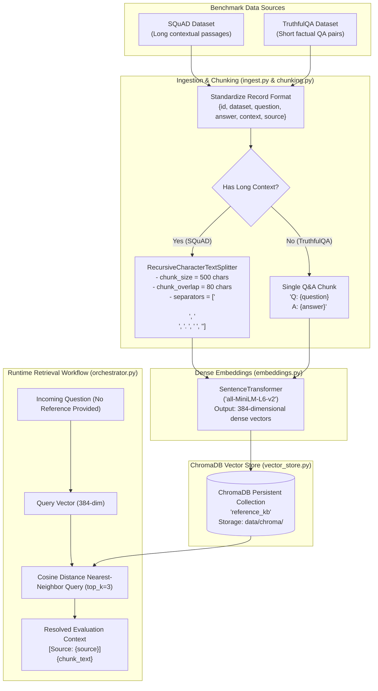

# RAG Pipeline: Ingestion, Chunking, Embeddings & Vector Retrieval

## Overview

The Reference Knowledge Base subsystem provides ground-truth context retrieval for evaluation when explicit reference answers or source documents are omitted from submissions. Built using local, open-source components, it operates with zero paid API dependencies and minimal retrieval latency.



---

## 1. Benchmark Ingestion ([`src/knowledge_base/ingest.py`](file:///C:/Sejal/Infosys%20Springboard/llm-response-eval-framework/src/knowledge_base/ingest.py))

The ingestion layer standardizes disparate evaluation benchmarks into a unified schema:

```python
{
    "id": str,          # e.g., "squad-56be4db0acb8001400a502ec" or "truthfulqa-14"
    "dataset": str,     # "squad" | "truthful_qa"
    "question": str,    # Prompt or benchmark question
    "answer": str,      # Ground-truth reference answer
    "context": str,     # Long-form supporting passage (SQuAD) or "" (TruthfulQA)
    "source": str       # Document title, article name, or category
}
```

### Dataset Characteristics
- **SQuAD (Stanford Question Answering Dataset)**: Supplies authentic encyclopedic context passages (Wikipedia articles) paired with extraction spans. Used to validate long-context retrieval, passage chunking, and grounded fact extraction.
- **TruthfulQA**: Supplies short, challenging questions designed to provoke LLM misconceptions and mimicry. Contains no long supporting context; used to benchmark concise factual QA and zero-context assertions.

---

## 2. Text Chunking Strategy ([`src/knowledge_base/chunking.py`](file:///C:/Sejal/Infosys%20Springboard/llm-response-eval-framework/src/knowledge_base/chunking.py))

To preserve semantic coherence while preventing context dilution, the framework implements LangChain's `RecursiveCharacterTextSplitter`:

### Hyperparameters
- **Chunk Size**: `500` characters
- **Chunk Overlap**: `80` characters
- **Hierarchy of Separators**: `["\n\n", "\n", ". ", " ", ""]`

### Handling Contextless Records
For datasets like TruthfulQA that lack an encyclopedic context passage, the chunker formats the question and answer into a synthetic factual chunk:

```text
Q: {question}
A: {answer}
```

This ensures every factual entry in the reference repository remains discoverable via vector similarity search.

---

## 3. Local Dense Embeddings ([`src/knowledge_base/embeddings.py`](file:///C:/Sejal/Infosys%20Springboard/llm-response-eval-framework/src/knowledge_base/embeddings.py))

Embeddings are generated using the `all-MiniLM-L6-v2` model from the `sentence-transformers` library:

- **Vector Dimensionality**: 384 dimensions
- **Inference Mode**: Fully local CPU/GPU execution (no external API calls or network egress)
- **Lazy Loading**: The model weights are instantiated once on first invocation via singleton caching:

```python
_model = None

def get_model() -> SentenceTransformer:
    global _model
    if _model is None:
        _model = SentenceTransformer("all-MiniLM-L6-v2")
    return _model
```

---

## 4. Vector Store Architecture ([`src/knowledge_base/vector_store.py`](file:///C:/Sejal/Infosys%20Springboard/llm-response-eval-framework/src/knowledge_base/vector_store.py))

- **Technology**: Embedded **ChromaDB** with local disk persistence.
- **Persistence Path**: `data/chroma/`
- **Collection Name**: `reference_kb`
- **Metadata Indexing**: Each vector is indexed alongside structured metadata:
  ```python
  metadatas = [
      {
          "record_id": chunk["record_id"],
          "dataset": chunk["dataset"],
          "source": chunk["source"]
      }
  ]
  ```

### Retrieval Procedure
1. Incoming query strings are embedded using `embed_query(query)`.
2. ChromaDB performs nearest-neighbor search using cosine distance metric:
   $$D_{\text{cosine}}(u, v) = 1 - \frac{u \cdot v}{\|u\|_2 \|v\|_2}$$
3. Returns top-$k$ (default $k=3$ for orchestrator, $k=5$ for CLI inspection) matching text passages, metadata, and distance scores.

---

## 5. Runtime Context Resolution & Fallback Hierarchy

The `EvaluationOrchestrator.resolve_context()` method implements a 4-tier context hierarchy:

```
┌────────────────────────────────────────────────────────┐
│ 1. Explicit Reference Answer Provided?                 │
│    YES ──► Use "Direct Reference Answer:\n{answer}"    │
└──────────────────────────┬─────────────────────────────┘
                           │ NO
┌──────────────────────────▼─────────────────────────────┐
│ 2. Supplied Source Document Provided?                  │
│    YES ──► Use "Supplied Source Document:\n{document}" │
└──────────────────────────┬─────────────────────────────┘
                           │ NO
┌──────────────────────────▼─────────────────────────────┐
│ 3. Query ChromaDB Vector Store with Question           │
│    HITS FOUND ──► Format top-k retrieved chunks        │
└──────────────────────────┬─────────────────────────────┘
                           │ NO HITS / RETRIEVAL FAILS
┌──────────────────────────▼─────────────────────────────┐
│ 4. Fallback Gracefully:                                │
│    "Retrieval unavailable. Evaluate with zero-shot     │
│     reference context."                                │
└────────────────────────────────────────────────────────┘
```

This guarantees that the evaluation pipeline remains functional under all operational conditions, whether evaluating against direct ground truth, domain documents, or general QA fallbacks.
