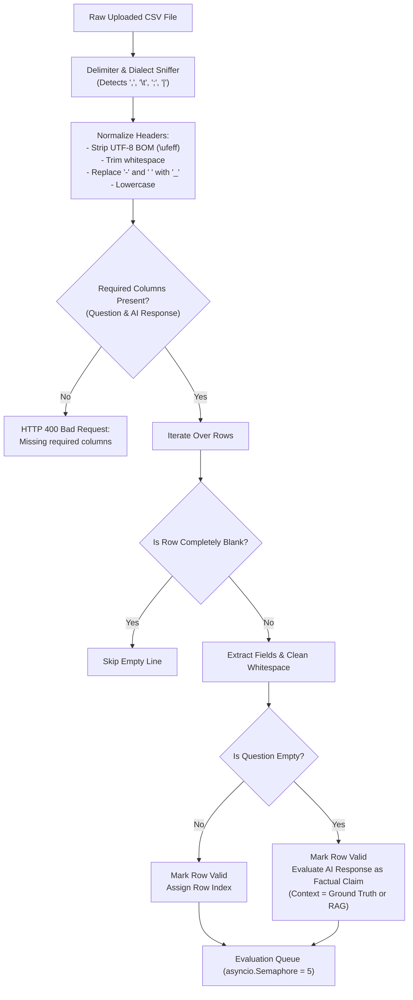

# CSV Upload Format & Batch Ingestion

## Overview

The framework supports high-volume batch evaluation via CSV uploads. To maximize interoperability with existing evaluation datasets (e.g., MT-Bench, TruthfulQA, custom internal test sets), the ingestion engine employs flexible header normalization, automated dialect sniffing, and fault-tolerant parsing.

---

## 1. Column Specifications

A valid batch CSV must contain at least two primary columns: the **Question/Prompt** and the **AI Response**. Ground-truth reference answers and source documents are optional but recommended when available.

| Column Category | Requirement | Supported Header Aliases (Case-Insensitive) | Description |
| :--- | :---: | :--- | :--- |
| **Question** | **Required** | `questions`, `question`, `query`, `prompt`, `q`, `user_question`, `input` | The prompt or question presented to the evaluated AI model. |
| **AI Response** | **Required** | `ai_responses`, `ai_response`, `response`, `answer`, `a`, `ai_answer`, `output`, `model_response`, `completion`, `generated_response`, `llm_response`, `model_answer` | The text generated by the model being evaluated. |
| **Reference Answer** | Optional | `reference_answer`, `reference`, `ref_answer`, `ground_truth`, `expected_answer`, `correct_answer`, `target`, `reference_response`, `ideal_answer` | Ground-truth answer used for factual accuracy and completeness verification. If omitted, the system falls back to ChromaDB RAG retrieval. |
| **Source Document** | Optional | `source_document`, `source`, `context`, `document`, `doc`, `retrieved_context`, `sources` | Supporting text passage or context document. Evaluated alongside the reference answer. |

---

## 2. Ingestion & Preprocessing Workflow



---

## 3. Resilience Features & Edge Cases

### A. Delimiter & Dialect Sniffing
The parser uses Python's `csv.Sniffer` on the first 4 KB of the file to automatically distinguish between commas (`,`), tabs (`\t`), semicolons (`;`), and pipes (`|`).

### B. Byte Order Mark (BOM) Stripping
Files exported from Microsoft Excel often prepend a UTF-8 BOM (`\ufeff`) to the first column name. The normalizer strips this prefix automatically:

```python
@staticmethod
def _normalize_header(header: str) -> str:
    return header.lower().strip().replace("-", "_").replace(" ", "_").lstrip("\ufeff")
```

### C. Empty Question Resilience
In some evaluation workflows, users evaluate free-form AI generations without an explicit prompt. When the `questions` column is empty:
- The row is **not rejected**.
- The `RelevanceAgent` evaluates the response based on clarity and internal coherence.
- The `AccuracyAgent` and `HallucinationAgent` verify the factual assertions against the provided reference or retrieved RAG context.

### D. Partial Failure Isolation
If a single row is malformed or throws an unexpected exception during agent execution:
- The record is flagged with `status="failed"` and its exception message is recorded in `error_message`.
- Processing of all remaining records in the batch continues without interruption.
- Failed rows are isolated from dimensional quality averages so they do not artificially distort batch scores.

---

## 4. Sample CSV Formats

### Standard Format (With Ground Truth References)
```csv
questions,ai_responses,reference_answer
"What is the chemical symbol for gold?","The chemical symbol for gold is Au.","Gold has the chemical symbol Au from the Latin aurum."
"What is the capital of Australia?","Canberra is the capital of Australia.","Canberra is the capital city of Australia."
"How many planets are in the solar system?","There are nine planets including Pluto.","There are eight official planets in the solar system."
```

### Context-Supported Format (With Source Documents)
```csv
question,model_response,reference_answer,source_document
"When was the Eiffel Tower completed?","It was completed on March 31, 1889.","March 31, 1889","The Eiffel Tower was built from 1887 to 1889. It was completed on 31 March 1889."
"What is photosynthesis?","Photosynthesis converts light into chemical energy.","Process used by plants to convert light into glucose.","Photosynthesis is a biological process used by plants, algae, and cyanobacteria."
```

### Minimal Format (RAG Fallback Mode)
```csv
query,output
"What is the speed of light?","The speed of light in vacuum is approximately 299,792,458 meters per second."
"Who wrote Romeo and Juliet?","William Shakespeare wrote Romeo and Juliet."
```
*Note: In minimal format, the framework queries ChromaDB with each question to retrieve supporting reference context automatically.*
